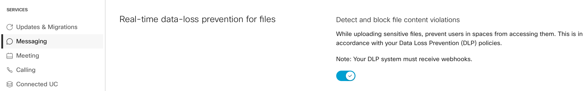
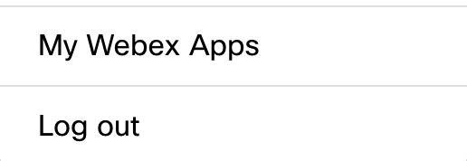
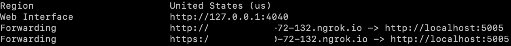
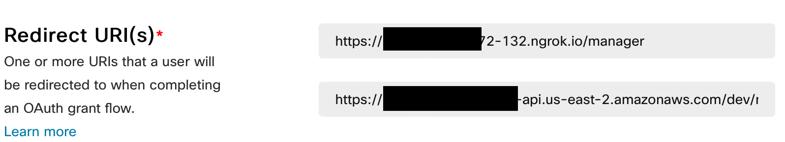
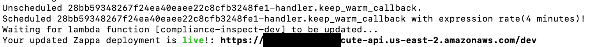

# Webex Real-time File DLP Example
This is an example of how [Webex Real-time File DLP](https://developer.webex.com/docs/api/guides/webex-real-time-file-dlp-basics) can be used. The DLP allows to scan files posted to Webex Space before they are available for download.
It is a great improvement, because traditional approach to DLP API implementation is reactive, no matter if it is provided by Webex, O365 or Google. A file is first
stored in the cloud service, after some time it is scanned by a DLP system and then eventually removed by the DLP system. This opens a window of opportunity
to download the file by any user who can access it. Real-time DLP removes this limitation and reduces the risk of data loss.

This example checks the MIME type of the file and if it doesn't match a regular expression from **ALLOWED_MIME_TYPES_REGEX** variable, it is rejected. In the example, only images are approved. Other more
sophisticated methods including content scanning can be implemented.

In order to gain access to users' content, the application needs to run with [Compliance](https://developer.webex.com/docs/compliance) Officer's permissions. It runs as an [Integration](https://developer.webex.com/docs/integrations) and implements [OAuth Grant Flow](https://developer.webex.com/blog/real-world-walkthrough-of-building-an-oauth-webex-integration) to securely receive OAuth tokens with just a limited scope that is needed for file scanning.

Webex Compliance Officer role with no admin privileges is a great example of "security from the ground up" approach.
Not every cloud service provides the separation of compliance and admin roles.

## Requirements
* [Webex Pro Pack](https://help.webex.com/en-US/article/np3c1rm/Pro-Pack-For-Control-Hub) is required to enable the real-time DLP
* the DLP application has to listen on a URL accessible from the public Internet
* the DLP application creates a special, so called **org-wide** webhook, for **messages/created** type of events.
The org-wide webhook is created using Compliance Officer's authorization and with **"ownedBy":"org"** parameter.

The example is designed to run in [AWS Lambda](https://aws.amazon.com/lambda/). In order to run locally, it needs an AWS S3.
S3 can be provided by [LocalStack](https://localstack.cloud). LocalStack docker image can be spinned using the provided [docker-compose.yml](./docker-compose.yml) file.

## How it works
Following diagram describes how a file is posted and how an external DLP application can intercept its publication in a Webex Space:


DLP application needs to have its [webhook](https://developer.webex.com/docs/webhooks) URL accessible via public Internet. The webhook receives an HTTP POST from Webex with the list of file URLs.
The application needs to respond within 10 seconds, otherwise the file is posted in the Space anyway with the indication
that it has not been scanned. The response has to be in a form of HTTP GET or HEAD to the file URL with additional parameter **dlpUnchecked**. For example if the file URL is
```
https://webexapis.com/v1/contents/Y2lzY29zcGFyazovL3VybjpURUFNOnVzLXdlc3QtMl9yL0NPTlRFTlQvNWI1NzAyZjAtMmJhNS0xMWVjLWIyYWUtNmQwNjAwMzBkYTg2LzA?allow=dlpEvaluating
```
the GET/HEAD should go to
```
https://webexapis.com/v1/contents/Y2lzY29zcGFyazovL3VybjpURUFNOnVzLXdlc3QtMl9yL0NPTlRFTlQvNWI1NzAyZjAtMmJhNS0xMWVjLWIyYWUtNmQwNjAwMzBkYTg2LzA?allow=dlpEvaluating,dlpUnchecked
```
At that moment the Webex application displays a "progress indicator" (a running circle next to the file) which informs
the sender that the file is being scanned.
This example is using HTTP HEAD to read the file MIME type. This saves time and also doesn't store unwanted copies of users' content.
HTTP GET can be used to get a full copy of the file and perform scanning of its content. For example for viruses
or confidential information.

Once the decision is made, the DLP application has to respond with HTTP PUT to file URL with parameter **result** and value of **reject** or **approve**. For example:
```
https://webexapis.com/v1/contents/Y2lzY29zcGFyazovL3VybjpURUFNOnVzLXdlc3QtMl9yL0NPTlRFTlQvNWI1NzAyZjAtMmJhNS0xMWVjLWIyYWUtNmQwNjAwMzBkYTg2LzA?result=reject
```
or
```
https://webexapis.com/v1/contents/Y2lzY29zcGFyazovL3VybjpURUFNOnVzLXdlc3QtMl9yL0NPTlRFTlQvNWI1NzAyZjAtMmJhNS0xMWVjLWIyYWUtNmQwNjAwMzBkYTg2LzA?result=approve
```

All the above GET/HEAD/PUT requests have to be authorized by a proper OAuth Access Token. The token has to be issued
for at least **spark-compliance:messages_read** and **spark-compliance:messages_write** scopes. The example uses also
**spark-compliance:rooms_read, spark-compliance:webhooks_read, spark-compliance:webhooks_write** (see **FILES_COMPLIANCE_SCOPE** variable) in order to manage the webhook and get information about the Space.

## How to run the application
Following steps are needed:
1. activate Real-time File DLP in Webex Control Hub
2. create a Compliance Officer account in [Webex Control Hub](https://admin.webex.com) (admin login required)
3. create a Webex integration with the proper compliance scope in [Webex for Developers](https://developer.webex.com) (user login required)
4. host the application locally or in AWS Lambda.

Local hosting needs:
* a runtime environment for [Flask](https://flask.palletsprojects.com)
* AWS S3 - a [docker-compose.yml](./docker-compose.yml) for spinning the LocalStack docker image is provided
* some way to provide a publicly accessible URL, for example [NGROK](https://ngrok.com)

AWS Lambda requires an AWS account. Lambda provides 1 million requests and 400,000 GB-Seconds per month for free. So this example can be hosted at $0 cost for a moderate Webex traffic.
The easiest way to deploy the example to AWS is using [Zappa](https://github.com/zappa/Zappa). [zappa_settings_sample.json](./zappa_settings_sample.json) is provided.
| :zap: the Zappa settings file includes also a part for LocalStack, but at the time of development it didn't work |
|-----------------------------------------|

### Activate Real-time File DLP
Open **Messaging** in [Webex Control Hub](https://admin.webex.com/messaging/settings) and turn on the **Real-time data-loss prevention for files**


| :zap: Webex Pro Pack is required |
|-----------------------------------------|

### Create a Compliance Officer account
1. open Users in the Webex Control Hub
2. select a user and open **Administrator roles**
3. check the **Compliance Officer** role
4. click **Save**


### Create a Webex Integration
1. login to [Webex for Developers](https://developer.webex.com)
2. click on your user's icon in the upper right corner and then on **My Webex Apps**



3. click on **Create a New App**
4. click on **Create an Integration**
5. fill in the required parameters, enter some dummy URL in **Redirect URI**. You will modify it later once you get it from your application hosting.
6. set scopes:
- [x] spark-compliance:messages_read
- [x] spark-compliance:messages_write
- [x] spark-compliance:rooms_read
- [x] spark-compliance:webhooks_read
- [x] spark-compliance:webhooks_write
7. click **Add Integration**
8. copy .env_local_sample to .env_local
9. copy & paste the **Integration ID**, **Client ID** and **Client Secret** to the appropriate variables in the .env_local
10. copy .env_dev_sample to .env_dev, fill in the same variables as in .env_local

### Run the Application Locally
All commands should be run relative to the directory into which this example has been downloaded. The commands are valid for Linux/MacOS. Check guides how to create and use Python virtual environment on Windows. 
1. install docker and docker-compose
2. start the LocalStack
```
docker-compose up
```
3. create a Python3 virtual environment and install the required packages
```
python3 -m venv venv
source venv/bin/activate
pip install -r requirements.txt
```
4. run the application
```
dotenv -f .env_local run python compliance_inspect.py
```
The application listens on TCP port 5005.

5. create a publicly accessible URL
```
ngrok http 5005
```



6. copy the **https** URL from NGROK screen, go back to the Webex Integration, set the **Redirect URI** to
```
https://uri_provided_by.ngrok.io/manager
```



| :zap: multiple Redirect URIs can be set, so the same Integration can be hosted locally and on AWS |
|-----------------------------------------|
7. in a web browser open the https://uri_provided_by.ngrok.io/authorize. If all goes well, you should get a Webex login page and the request should be seen both in NGROK and application consoles.
8. login using a Compliance Officer's e-mail address
9. successful OAuth Grant Flow finishes at https://uri_provided_by.ngrok.io/authdone with a text  
**Thank you for providing the authorization. You may close this browser window.**
10. application is now ready for use, try posting a file in a Webex Space

### Run the Application on AWS Lambda
1. create AWS account and install aws cli
2. set your aws credentials
3. copy .boto_sample to .boto, set the AWS credentials there
4. copy zappa_settings_sample.json to zappa_settings.json, no changes should be needed except for **aws_region**
5. check that you've created .env_dev as mentioned above
6. deploy the application to AWS lambda
```
zappa deploy dev
```
7. at the end of the successful deployment an application URL is presented



8. copy the URL and paste it to Webex Integration's Redirect URI. Append **/manager** at the end, so it looks like: https://long_aws_url.amazonaws.com/dev/manager


9. start monitoring the application using
```
zappa tail dev
```
10. in a web browser open the https://long_aws_url.amazonaws.com/dev/authorize. If all goes well, you should get a Webex login page and the request should be seen in the application console.
11. login using a Compliance Officer's e-mail address
12. successful OAuth Grant Flow finishes at https://long_aws_url.amazonaws.com/dev/authdone with a text  
**Thank you for providing the authorization. You may close this browser window.**
13. application is now ready for use, try posting a file in a Webex Space

## Credits
Thanks to Ralf Schiffert raschiff@cisco.com for evangelization and providing sample shell scripts which demonstrate the functionality.
