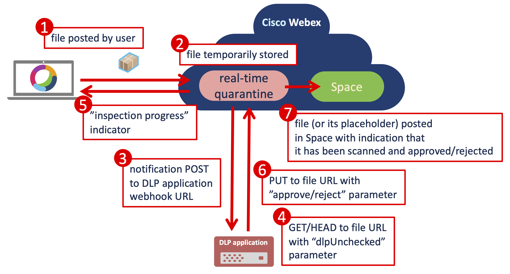
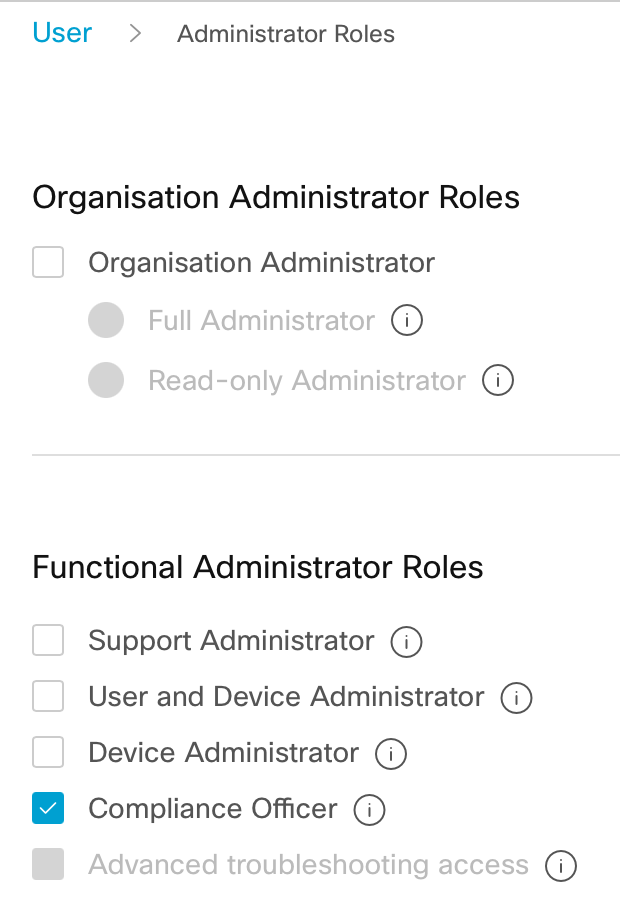

# Webex Real-time File DLP Example
This is an example of how [Webex Real-time File DLP](https://developer.webex.com/docs/api/guides/webex-real-time-file-dlp-basics) can be used. The DLP allows to scan files posted to Webex Space before they are available for download.
It's a great improvement, because traditional DLP is reactive, no matter if it's Webex, O365 or Google - file is first
stored in the cloud service, then scanned by a DLP system and eventually removed. This opens a short window of opportunity
to download the file. Real-time DLP removes this limitation and reduces the risk of data loss.

This example checks the MIME type of the files and if it doesn't match a regular expression from **ALLOWED_MIME_TYPES_REGEX** variable, it's rejected. In the example, only images are approved. Other more
sophisticated methods including content scanning can be implemented.

In order to gain access to users' content, the application needs to run with [Compliance](https://developer.webex.com/docs/compliance) Officer's permissions. It runs as an [Integration](https://developer.webex.com/docs/integrations) and implements [OAuth Grant Flow](https://developer.webex.com/blog/real-world-walkthrough-of-building-an-oauth-webex-integration) to securely receive OAuth tokens with just a limited scope that is needed for file scanning.

## Requirements
* [Webex Pro Pack](https://help.webex.com/en-US/article/np3c1rm/Pro-Pack-For-Control-Hub) is required to enable the real-time DLP
* the DLP application has to listen on a URL accessible from public Internet
* the DLP application creates a special, so called **org-wide** webhook, for **messages/created** type of events.
The org-wide webhook is created using Compliance Officer's authorization and with **"ownedBy":"org"** parameter.

The example is designed to run in [AWS Lambda](https://aws.amazon.com/lambda/). In order to run locally, it needs an AWS S3.
S3 can be provided by [LocalStack](https://localstack.cloud). LocalStack docker image can be spinned using the [docker-compose.yml](./docker-compose.yml) file.

## How it works
Following diagram describes how a file is posted and how an external DLP application can intercept its publication in a Space:



DLP application needs to have its [webhook](https://developer.webex.com/docs/webhooks) URL accessible via public Internet. The webhook receives a HTTP POST from Webex with the list of file URLs.
The application needs to respond within 10 seconds, otherwise the file is posted in the Space anyway with indication
that it has not been scanned. The response has to be in a form of HTTP GET or HEAD to the file URL with additional parameter **dlpUnchecked**. For example if the file URL is
```
https://webexapis.com/v1/contents/Y2lzY29zcGFyazovL3VybjpURUFNOnVzLXdlc3QtMl9yL0NPTlRFTlQvNWI1NzAyZjAtMmJhNS0xMWVjLWIyYWUtNmQwNjAwMzBkYTg2LzA?allow=dlpEvaluating
```
the GET/HEAD should go to
```
https://webexapis.com/v1/contents/Y2lzY29zcGFyazovL3VybjpURUFNOnVzLXdlc3QtMl9yL0NPTlRFTlQvNWI1NzAyZjAtMmJhNS0xMWVjLWIyYWUtNmQwNjAwMzBkYTg2LzA?allow=dlpEvaluating,dlpUnchecked
```
At that moment the Webex application displays a "progress indicator" (a running circle next to the file) which informs
the sender that the file is being scanned.
This example is using HTTP HEAD to read the file MIME type. This saves time and also doesn't store unwanted copies of users' content.
HTTP GET can be used to get a full copy of the file and perform scanning of its content. For example for viruses
or confidential information.

Once the decision is made, the DLP application has to respond with HTTP PUT to file URL with parameter **result** and value of **reject** or **approve**. For example:
```
https://webexapis.com/v1/contents/Y2lzY29zcGFyazovL3VybjpURUFNOnVzLXdlc3QtMl9yL0NPTlRFTlQvNWI1NzAyZjAtMmJhNS0xMWVjLWIyYWUtNmQwNjAwMzBkYTg2LzA?result=reject
```
or
```
https://webexapis.com/v1/contents/Y2lzY29zcGFyazovL3VybjpURUFNOnVzLXdlc3QtMl9yL0NPTlRFTlQvNWI1NzAyZjAtMmJhNS0xMWVjLWIyYWUtNmQwNjAwMzBkYTg2LzA?result=approve
```

All the above GET/HEAD/PUT requests have to be authorized by a proper OAuth Access Token. The token has to be issued
for at least **spark-compliance:messages_read** and **spark-compliance:messages_write** scopes. The example uses also
**spark-compliance:rooms_read, spark-compliance:webhooks_read, spark-compliance:webhooks_write** (see **FILES_COMPLIANCE_SCOPE** variable) in order to manage the webhook and get information about the Space.

## How to run the application
Following steps are needed:
1. create a Compliance Officer account in [Webex Control Hub](https://admin.webex.com) (admin login required)
2. create a Webex integration with the proper compliance scope in [Webex for Developers](https://developer.webex.com) (user login required)
3. host the application locally or in AWS Lambda.

Local hosting needs:
* a runtime environment for [Flask](https://flask.palletsprojects.com)
* AWS S3 - a [docker-compose.yml](./docker-compose.yml) for spinning the LocalStack docker image is provided
* some way to provide a publicly accessible URL, for example [NGROK](https://ngrok.com)

AWS Lambda requires an AWS account. Lambda provides 1 million requests and 400,000 GB-Seconds per month for free. So this example can be hosted at $0 cost for a moderate Webex traffic.
The easiest way to deploy the example to AWS is using [Zappa](https://github.com/zappa/Zappa). [zappa_settings_sample.json](./zappa_settings_sample.json) is provided.
| :zap: the Zappa settings file includes also a part for LocalStack, but at the time of development it didn't work |
|-----------------------------------------|

### Create a Compliance Officer account
1. open Users list in the Webex Control Hub
2. select a user and open **Administrator roles**
3. check the **Compliance Officer** role
4. click **Save**

