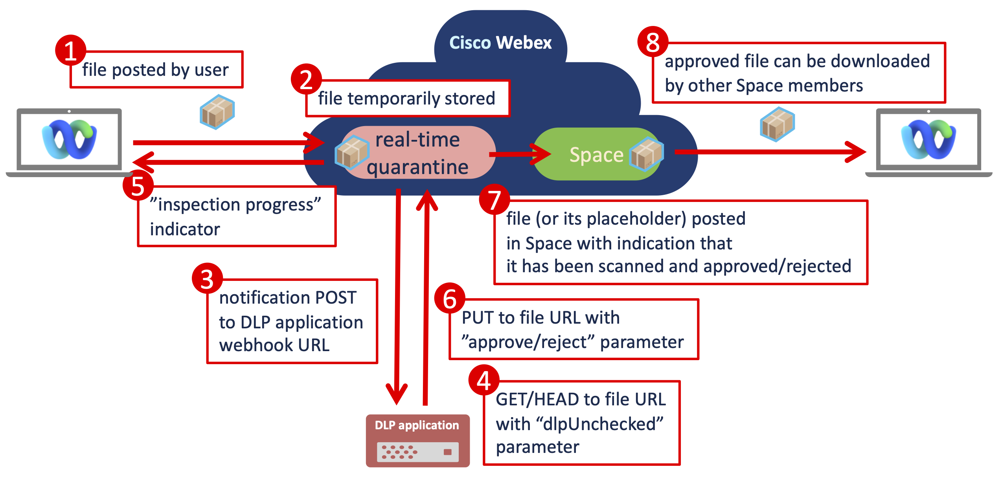

# Webex Real-time File DLP Example
This is an example of how [Webex Real-time File DLP](https://developer.webex.com/docs/api/guides/webex-real-time-file-dlp-basics) can be used. The DLP allows to scan files posted to Webex Space before they are available for download.
It's a great improvement, because traditional DLP is reactive, no matter if it's Webex, O365 or Google - file is first
stored in the cloud service, then scanned by a DLP system and eventually removed. Real-time DLP removes this limitation and reduces the risk of data loss.
## How it works

